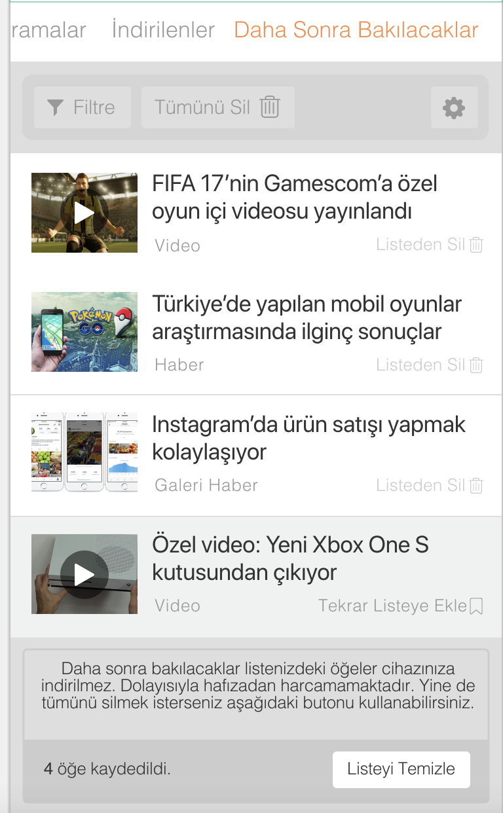

# DH Android Task

Donanımhaber Android Application consists of two main parts. The first part is the forum section, which consists of topics created by users and admins. The second part is the news section where our editors provide content.

### Task:

We want you to make a small news listing application with the api we use in the official application. In this news listing application, users will be able to save news to favorites with long click or any design implementation. On normal click app will open browser and navigate the url from api (SourceUrl). And favorites will always be available to users regardless of internet status (offline). 

- You should have two fragments (News and Favorites) and both should be connected via viewpager.
- The news listing section should have an infinite scroll feature.
- In the Favorites section, you should use realm or room.
- Using Realm is a bonus.
- Using Kotlin is a bonus.
- MVP or MVVM bonus.
- Material design is bonus.

### Design:

The designs are given for you to get an idea. It is not mandatory to follow the designs exactly.

 

### Informations:

- Endpoint: https://api.donanimhaber.com/dev/and/api/newest?pageIndex=0&pageSize=15
- You only need to parse the areas you want to use. Don't waste your time with unnecessary fields.
- Pagination via pageIndex (incremental)
- You can use pojo for retrofit (https://www.jsonschema2pojo.org)
